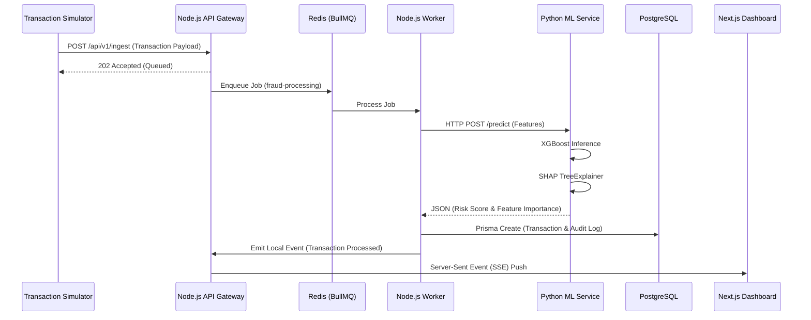

<div align="center">
  
  
  <h1>SentinelAI</h1>
  <p><strong>Enterprise-Grade Risk & Fraud Intelligence Platform</strong></p>

  [](https://opensource.org/licenses/MIT)
  [](https://nextjs.org/)
  [](https://nodejs.org/)
  [](https://fastapi.tiangolo.com/)
  [](https://www.postgresql.org/)
  [](https://redis.io/)
</div>

<br/>

## 📖 Overview

**What is SentinelAI?**
SentinelAI is a production-inspired AI engineering platform built to detect, explain, and investigate financial fraud in real-time. It processes high-throughput transaction streams, evaluates them against advanced machine learning models (XGBoost), generates mathematically rigorous explainability metrics (SHAP), and streams the results instantly to a rich, interactive Next.js dashboard.

**Why was it built?**
SentinelAI was engineered from the ground up as a flagship portfolio project to demonstrate mastery across the entire modern engineering stack: **AI Engineering, MLOps, Distributed Systems, Full-Stack Development, and System Architecture.** It proves that an AI system can be highly scalable, mathematically explainable, and wrapped in an enterprise-quality developer experience.

## ✨ Features

- **⚡ Real-Time Streaming AI Pipeline:** Ingests transaction payloads, queues them securely via Redis/BullMQ, and streams inference results back to the client via Server-Sent Events (SSE).
- **🧠 Explainable AI (XAI):** Doesn't just return a "fraud score." Utilizes `SHAP` (SHapley Additive exPlanations) to mathematically break down *why* a transaction was flagged, mapping individual feature contributions to the final prediction.
- **📊 Enterprise Dashboard:** A polished Next.js UI featuring Live Transaction Tables, Global Threat Heatmaps, a Developer Console, and an Architecture Explorer.
- **🏗️ MLOps Integrations:** Includes a Model Registry, Dataset Explorer, and historical Experiment Tracking.
- **🛡️ Production-Ready Backend:** Built on Node.js/Express and Prisma (PostgreSQL), utilizing strict TypeScript interfaces, standardized API error handling, and robust logging.

---

## 🏛️ System Architecture

SentinelAI utilizes a decoupled, event-driven microservices architecture to ensure high availability and prevent the ML inference engine from blocking the API Gateway during traffic spikes.

### The AI Pipeline & Request Lifecycle



---

## 🚀 Quick Start

The entire platform is heavily containerized for a flawless developer experience. **One command** stands up the Database, Queue, API Gateway, ML Service, and Frontend.

### Prerequisites
- Docker & Docker Compose
- Node.js 18+ (for local UI development)
- Python 3.10+ (for local ML development)

### One-Command Setup

```bash
git clone https://github.com/PulkitSardana/SentinelAI.git
cd SentinelAI

# Start the entire infrastructure and microservices
make dev

# Or using docker-compose directly:
docker compose up -d --build
```
> **Note:** The Next.js frontend will be available at `http://localhost:3000`. The backend API runs on `http://localhost:4000`, and the ML Service runs on `http://localhost:8000`.

---

## 📚 Documentation

Dive deeper into the engineering decisions and technical specifics of SentinelAI in our comprehensive wiki:

- [System Design & Tradeoffs](./docs/system-design.md) - Why BullMQ? Why Postgres? Why SSE over WebSockets?
- [Architecture Overview](./docs/architecture.md)
- [Backend Engineering](./docs/backend.md)
- [Frontend Engineering](./docs/frontend.md)
- [Machine Learning & XAI](./docs/ml.md)
- [Database Schema](./docs/database.md)
- [Security & Performance](./docs/security.md)

---

## 📸 Platform Tour

*(Replace placeholders with actual repository screenshots)*

### Live Intelligence Dashboard


### Explainability Studio (SHAP)


### Architecture Explorer


---

## 🛠️ Technology Stack

| Domain | Technologies Used |
| :--- | :--- |
| **Frontend** | Next.js 15 (App Router), React, Tailwind CSS, Recharts, Lucide, Zustand |
| **Backend API** | Node.js, Express, TypeScript, Zod, BullMQ |
| **ML Service** | Python, FastAPI, XGBoost, SHAP, Pandas, Scikit-Learn |
| **Database** | PostgreSQL, Prisma ORM |
| **Infrastructure**| Docker, Docker Compose, Redis |

---

## 🤝 Contribution Guidelines

SentinelAI is an open-source portfolio project. While major feature requests are not actively accepted, PRs addressing code quality, type safety, or documentation improvements are welcome. Please read our [Contribution Guide](CONTRIBUTING.md) for branch naming and commit conventions.

## 📄 License

This project is licensed under the MIT License - see the [LICENSE](LICENSE) file for details.
