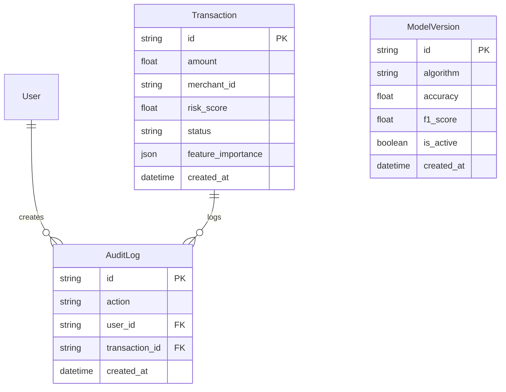

# Database Schema

SentinelAI relies on **PostgreSQL** as its primary data store, managed via the **Prisma ORM**.

## Entity Relationship (ER) Diagram

## Prisma Advantages

1. **Type Safety:** Prisma auto-generates TypeScript types directly from our `schema.prisma` file, ensuring that the Node.js API Gateway cannot query non-existent columns and always returns the expected types to the frontend.
2. **Migrations:** Database schema evolution is handled declaratively.
3. **Connection Pooling:** In a high-throughput environment, efficiently managing database connections is critical. Prisma handles connection pooling natively, preventing PostgreSQL from being overwhelmed by the BullMQ background workers.

## Indexing Strategy

To support the real-time Dashboard aggregations (e.g., calculating Fraud Rate over the last 24 hours), we have applied appropriate indexes on the `created_at` and `status` columns in the `Transaction` table.
